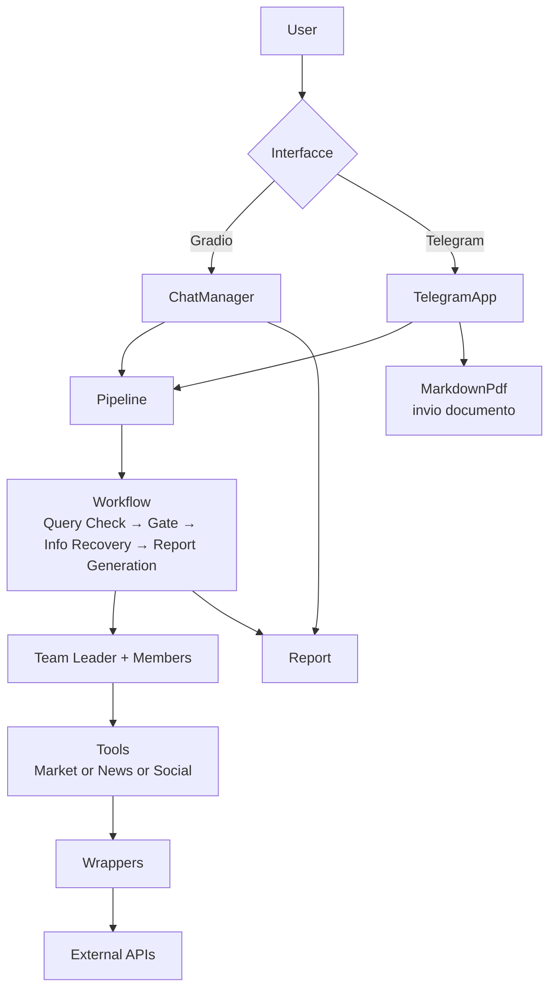
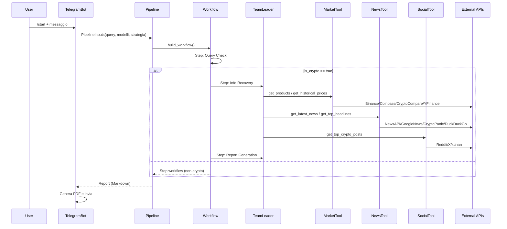

# Stato Attuale: Architettura e Flussi (upo-appAI)

Sintesi dell’architettura attuale e del flusso runtime dell’app, con diagrammi compatti e riferimenti ai componenti principali.

## Panorama Componenti

- `src/app/__main__.py`: Entrypoint. Avvia interfaccia Gradio (`ChatManager`) e bot Telegram (`TelegramApp`).
- `interface/chat.py`: UI Gradio. Gestisce storico chat, chiama `Pipeline.interact()`.
- `interface/telegram_app.py`: Bot Telegram. Gestisce conversazione, configura modelli/strategia, esegue `Pipeline.interact_async()` e genera PDF.
- `agents/core.py`: Definisce `PipelineInputs`, agenti (`Team`, `Query Check`, `Report Generator`) e strumenti (Market/News/Social).
- `agents/pipeline.py`: Orchestrazione via `agno.workflow`. Steps: Query Check → Gate → Info Recovery (Team) → Report Generation.
- `agents/prompts/…`: Istruzioni per Team Leader, Market/News/Social agents, Query Check e Report Generation.
- `api/tools/*.py`: Toolkits aggregati (MarketAPIsTool, NewsAPIsTool, SocialAPIsTool) basati su `WrapperHandler`.
- `api/*`: Wrappers per provider esterni (Binance, Coinbase, CryptoCompare, YFinance, NewsAPI, GoogleNews, CryptoPanic, Reddit, X, 4chan).
- `api/wrapper_handler.py`: Fallback con retry e try_all sui wrappers.
- `configs.py`: Config app, modelli, strategie, API e caricamento da `configs.yaml`/env.

## Architettura (Overview)

## Sequenza (Telegram)

## Workflow & Agenti

- Step 1: `Query Check` (Agent) — valida la natura crypto della richiesta, output schema `QueryOutputs` (`response`, `is_crypto`).
- Step 2: Gate — interrompe se `is_crypto == false`.
- Step 3: `Info Recovery` (Team) — TeamLeader orchestration con `PlanMemoryTool` e Reasoning, dispatch agli agenti Market/News/Social.
- Step 4: `Report Generation` (Agent) — sintetizza i risultati nel report finale (stringa Markdown).

## Tools & Wrappers

- MarketAPIsTool → `BinanceWrapper`, `YFinanceWrapper`, `CoinBaseWrapper`, `CryptoCompareWrapper`.
- NewsAPIsTool → `GoogleNewsWrapper`, `DuckDuckGoWrapper`, `NewsApiWrapper`, `CryptoPanicWrapper`.
- SocialAPIsTool → `RedditWrapper`, `XWrapper`, `ChanWrapper`.
- `WrapperHandler`:
  - `try_call` con retry per wrapper corrente, fallback sequenziale.
  - `try_call_all` per aggregare risultati multipli.
  - Configurabile via `set_retries(attempts, delay_seconds)`.

## Configurazione & Modelli

- Modelli (default): `gemini-2.0-flash` per Team, Team Leader, Query Analyzer, Report Generator.
- Strategie: es. `Conservative` (descrizione testuale). Selezionabili da UI.
- `configs.yaml` e variabili env determinano modelli, porta server (`AppConfig.port`) e opzioni sharing Gradio.

## Variabili d’Ambiente (usate dai wrappers)

- `TELEGRAM_BOT_TOKEN` — Bot Telegram.
- `COINBASE_API_KEY`, `COINBASE_API_SECRET` — Coinbase Advanced Trade.
- `CRYPTOCOMPARE_API_KEY` — CryptoCompare.
- `NEWS_API_KEY` — NewsAPI.
- `CRYPTOPANIC_API_KEY` (+ opzionale `CRYPTOPANIC_API_PLAN`) — CryptoPanic.
- `REDDIT_API_CLIENT_ID`, `REDDIT_API_CLIENT_SECRET` — Reddit (PRAW).
- `X_API_KEY` — rettiwt API key (CLI richiesto).

## Note di Implementazione

- I wrappers sono prevalentemente sincroni; la Pipeline usa esecuzione asincrona per il workflow (`interact_async`), con stream di eventi dai `agno.workflow` steps.
- Il Team Leader segue prompt comportamentale: ciclo di pianificazione/esecuzione/aggiornamento task con `PlanMemoryTool`.
- L’output Telegram allega un PDF generato da `markdown_pdf`. La UI Gradio restituisce testo formattato.

## Test & Copertura (repo)

- Test unitari/integrati in `tests/` per wrappers (Market/News/Social), tools e handler.
- Esecuzione consigliata: `pytest -q` con variabili d’ambiente correttamente impostate (alcuni test richiedono API keys).