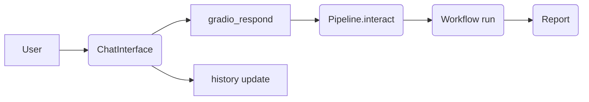
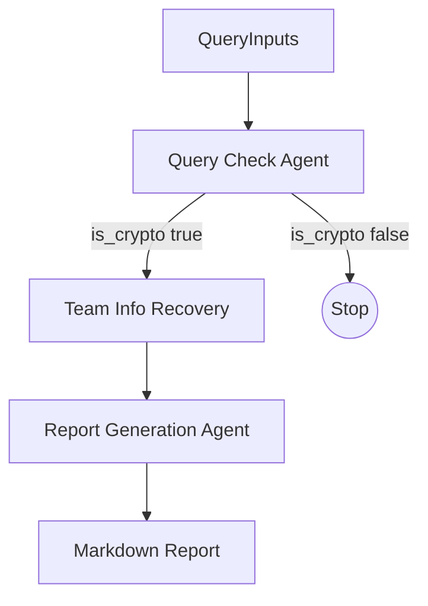
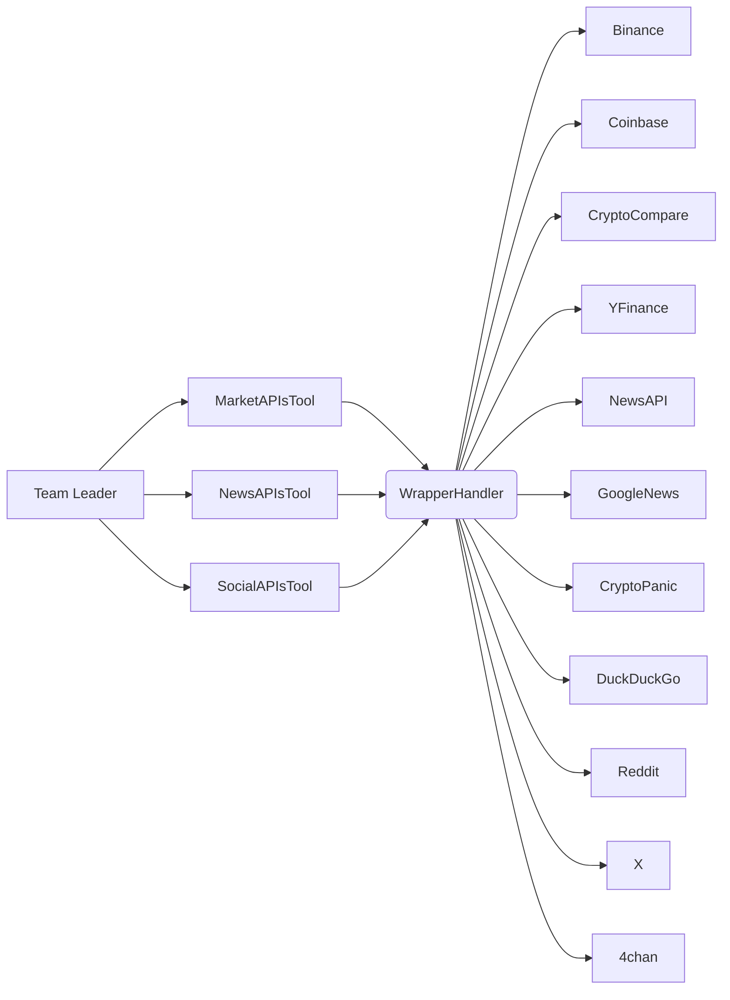

# Diagrammi di Flusso e Sequenza (Sintesi)

Documentazione breve con blocchi testuali e mermaid per flussi principali.

## Flusso Gradio Chat



## Flusso Telegram Bot

```
/start
  │
  ├─> CONFIGS state
  │    ├─ Model Team ↔ choose_team(index)
  │    ├─ Model Output ↔ choose_team_leader(index)
  │    └─ Strategy ↔ choose_strategy(index)
  │
  └─> Text message → __start_team
        └─ run team → Pipeline.interact_async
             ├─ build_workflow
             ├─ stream events (Query Check → Gate → Info Recovery → Report)
             └─ send PDF (markdown_pdf)
```

## Pipeline Steps (Workflow)



## Team Leader Loop (PlanMemoryTool)

```
Initialize Plan with tasks
Loop until no pending tasks:
  - Get next pending task
  - Dispatch to specific Agent (Market/News/Social)
  - Update task status (completed/failed)
  - If failed & scope comprehensive → add retry task
After loop:
  - List all tasks & results
  - Synthesize final report
```

## Tools Aggregazione

